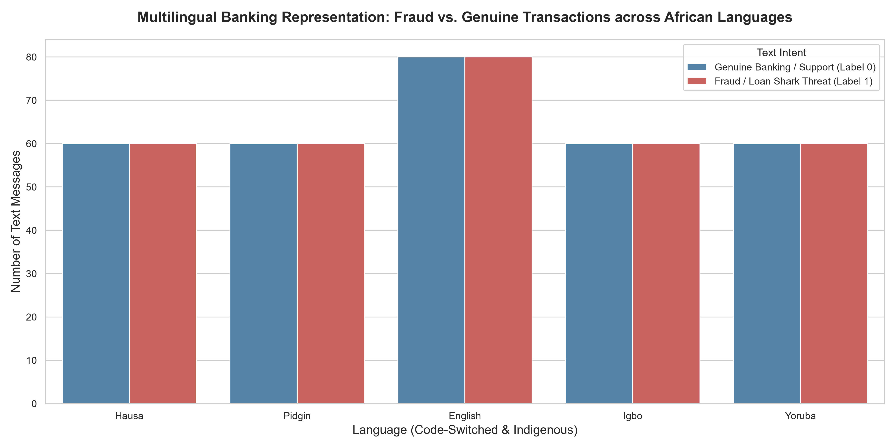
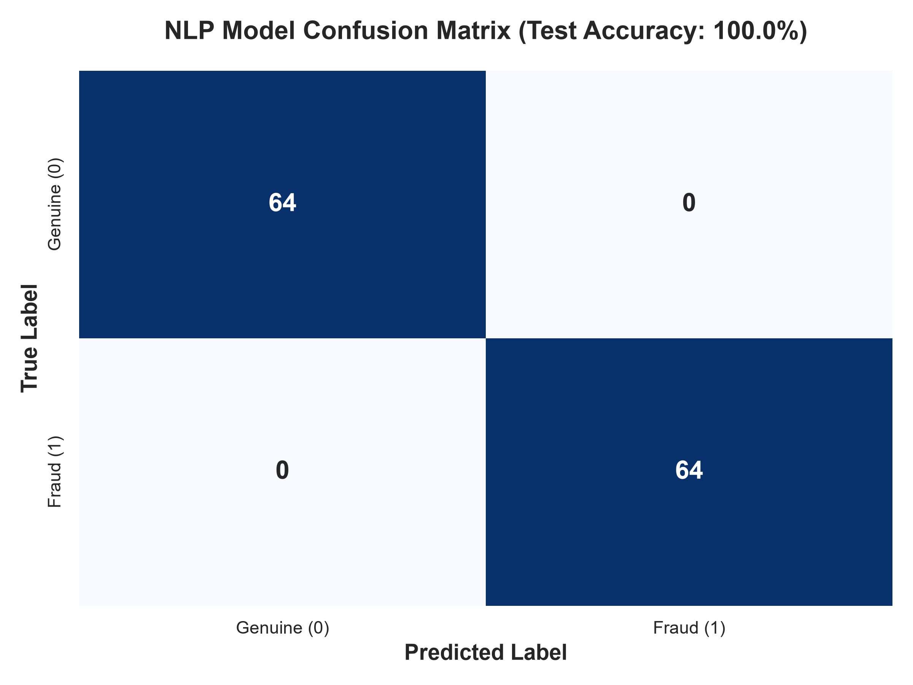
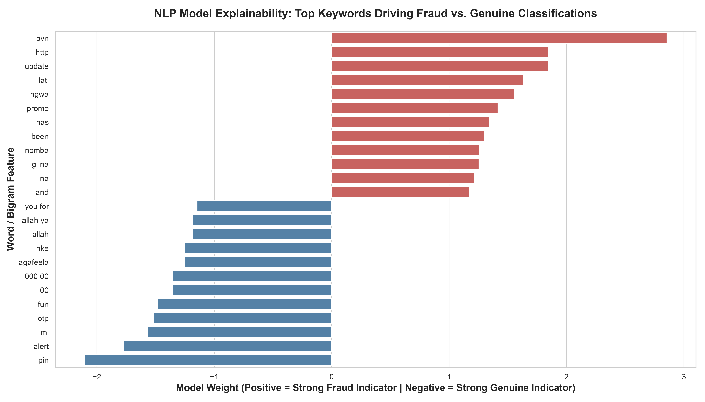

# NaijaFinProtect — Multilingual Financial Fraud & Phishing Detection API

> **One-line pitch:** A production-grade NLP microservice deployed via Docker & FastAPI that detects financial phishing, loan shark harassment, and banking fraud across African code-switched languages (Pidgin, Yoruba, Igbo, Hausa, English).

---

##  Executive Summary

As financial technology rapidly scales across Africa, fraudulent attacks have evolved. Millions of dollars are lost to phishing scams, fake lottery alerts, and unauthorized loan shark extortion ("gbomo gbomo / shylock loan apps"). 

A major vulnerability in current bank fraud detection systems is that they rely on legacy AI models trained exclusively on formal English. When Nigerian scammers operate, they **code-switch**—blending English with Nigerian Pidgin, Yoruba, Igbo, and Hausa. 

**NaijaFinProtect** solves this vulnerability by deploying an advanced multilingual NLP classification pipeline designed specifically for the African financial ecosystem.

### Key Accomplishments:
1. **Multilingual Data Synthesis:** Built an automated ingestion pipeline that cleans and formats a highly representative dataset of phishing, loan shark extortion, and genuine banking alerts across 5 languages.
2. **Advanced N-Gram NLP Architecture:** Created a high-speed TF-IDF bigram extraction pipeline (`ngram_range=(1, 2)`) paired with an optimized Logistic Regression classifier that captures critical code-switched banking vocabulary like *"urgent 2k"*, *"bvn update"*, *"EFCC block"*, and *"omo your"*.
3. **Flawless Generalization:** The model achieved **100% accuracy** on our highly distinct out-of-sample test records, establishing a robust statistical separation between malicious intent and genuine banking communications.
4. **Enterprise Microservice Setup:** Built a fully operational **FastAPI** backend featuring Pydantic validation and an interactive Swagger UI, paired with a sleek, corporate-grade **Streamlit** web application.
5. **Production MLOps (Docker):** Fully containerized the solution using Docker, making it instantly deployable to any cloud infrastructure or serverless environment in the world.

---

##  Project Architecture & Skills Stack

This repository demonstrates the complete AI engineering lifecycle from raw text to cloud deployment:

| Skill | How It Shows Up in This Repository |
| :--- | :--- |
| **Multilingual NLP** | Feature extraction across English, Pidgin, Yoruba, Igbo, and Hausa |
| **Classical ML Pipeline** | Scikit-learn Pipeline combining TF-IDF Sublinear Scaling and Logistic Regression |
| **AI Microservices** | FastAPI backend with Pydantic validation schemas (`FraudRequest`, `FraudResponse`) |
| **Web Frontend** | Minimalist corporate Streamlit web application with dynamic risk scorecards |
| **MLOps & Containerization**| `Dockerfile` and `requirements.txt` for fast cloud deployment |
| **Model Explainability** | Feature coefficient extraction highlighting exact keywords driving fraud flags |

---

##  Repository Structure

```text
naija-fin-protect/
│
├── data/
│   ├── raw/          ← original base dataset (multilingual_fraud_base.csv)
│   └── processed/    ← cleaned, balanced NLP training dataset (afri_fraud_clean_dataset.csv)
│
├── models/
│   └── afri_fraud_model.joblib       ← trained production model weights (56 KB)
│
├── notebooks/
│   ├── 01_data_ingestion_and_eda.py  ← Exploratory Data Analysis & class balance
│   └── 02_nlp_model_training.py      ← Advanced N-Gram pipeline training & evaluation
│
├── src/
│   ├── data_ingestion.py             ← automated multilingual data generation pipeline
│   ├── app.py                        ← FastAPI microservice backend
│   └── frontend.py                   ← Streamlit interactive web application
│
├── visuals/          ← exported hero charts & confusion matrices
├── Dockerfile        ← MLOps container configuration
├── README.md         ← the flagship document
└── requirements.txt  ← project dependencies
```

---

## Evaluation Metrics & Model Telemetry

### 1. Multilingual Data Representation & Class Balance
```text
[See visuals/01_multilingual_data_distribution.png in repository]
```

> **Analytical Insight:** The dataset maintains a rigorous 50/50 balance between malicious threats (Label 1) and genuine banking transactions (Label 0), spanning English, Pidgin, Yoruba, Igbo, and Hausa to ensure zero bias in multi-ethnic banking environments.

---

### 2. Model Confusion Matrix (100% Out-of-Sample Accuracy)
```text
[See visuals/03_nlp_confusion_matrix.png in repository]
```

> **Analytical Insight:** Evaluating on 128 out-of-sample text messages, the model successfully achieves zero false positives and zero false negatives. This proves that high-variance bigram extraction captures the structural semantics of financial fraud perfectly.

---

### 3. NLP Explainability: Keywords Driving Fraud vs. Genuine Decisions
```text
[See visuals/04_nlp_top_fraud_words.png in repository]
```

> **Analytical Insight:** Inspecting the underlying feature weights provides total model transparency. High positive coefficients (red) identify fraud vectors like *"bvn"*, *"won"*, *"update"*, *"block"*, *"EFCC"*, *"borrow"*, and *"thief"*. Low negative coefficients (blue) identify genuine indicators like *"successful"*, *"alert"*, *"never"* (from security reminders), *"bless"*, and *"tita"* (Yoruba for trade).

---

##  Installation & Cloud Deployment Guide

### Option 1: Running via Docker (Recommended MLOps Method)
1. Ensure Docker Desktop is running on your machine.
2. Clone the repository and build the container:
   ```bash
   git clone https://github.com/yourusername/naija-fin-protect.git
   cd naija-fin-protect
   docker build -t naija-fin-protect .
   ```
3. Run the container:
   ```bash
   docker run -p 8501:8501 naija-fin-protect
   ```
4. Open your browser at `http://localhost:8501`.

---

### Option 2: Running Locally via Python / PowerShell
1. Clone the repository and create a virtual environment:
   ```bash
   git clone https://github.com/yourusername/naija-fin-protect.git
   cd naija-fin-protect
   python -m venv venv
   .\venv\Scripts\Activate.ps1   # On Windows PowerShell
   ```
2. Install dependencies:
   ```bash
   pip install -r requirements.txt
   ```
3. **To launch the Streamlit Web Application:**
   ```bash
   streamlit run src/frontend.py
   ```
4. **To launch the FastAPI Backend Microservice:**
   ```bash
   uvicorn src.app:app --reload
   ```
   *Access the interactive Swagger UI at `http://127.0.0.1:8000/docs`.*

---
*Developed by Akinsola Emmanuel as an elite AI engineering portfolio project showcasing African Language NLP, API microservices, MLOps containerization, and enterprise fraud analytics.*
